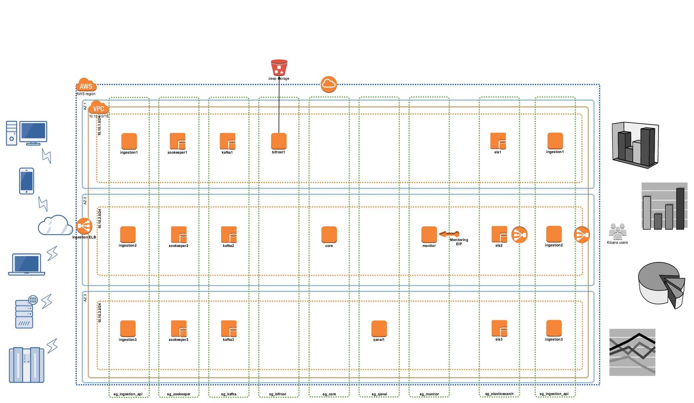

# Amazon EC2 deployment

To deploy Samsara on Amazon EC2 there are multiple options. Which one
is the best suited for your case depends on your specific workload.

Here we are going to see the following options:

  * [Small deployment](#small-deployment) - single machine, no redundancy
  * Small redundant deployment - 3 hosts, 3 AZs, triple replication
  * Compact deployment - 7 hosts, 3 AZs, triple replicaiton, scalable
    workload
  * [Large deployment](#large-deployment) - 18 hosts, 3 AZs, triple replication,
    indepentely scalable workload.


## Small deployment

The small deployment is fine only for demo, development and testing
purposes.  It doesn't provide redundancy to machine loss and all
processes fight for the same resources (CPU / Memory / IO).  In
particular if the IO of the storage isn't particularly fast then the
query experience isn't great.
**I don't recommend this deployment for a production use**.

### Storage

In this case we will use a single machine with attached storage and
run all containers in the same machine.  The host configuration will
contain LVM2 so if the storage space isn't enough then a new disk
volume can be easily added and the storage space extended.

Two logical volumes will be mounted:

  * `/data` for the database storage
  * `/logs` for the application logs

### Linking

For this simple set up we will make use of `docker-compose`
to coordinate and link all each container.


### Deployment steps

To deploy the app to AWS you basically need to do only two main steps.

  - build the instance images (automated with `packer`)
  - build the stack on aws (automated with `terraform`)

#### To build the images

Set your AWS access keys:

```bash
export AWS_ACCESS_KEY_ID=xxxxx
export AWS_SECRET_ACCESS_KEY=xxxxx
```


By default the tool will build two images.  One with all OS updates
and basic tools installed but without data storage, the second one is
based on the first plus a EBS storage of 200Gb.  If you want to change
the EBS disk size to make it smaller (or bigger) then set the following
packer variable `data_disk_size` to the `build-all-images.sh`

It will use LVM2 to create two logical volumes with the following
repartition:

  - 90% reserved to the `/data` volume
  - 10% reserved to the `/logs` volume


Then run the packer tool providing a base (unique) name for the build,
and any other variable you might want to change.

```bash
cd images
./build-all-images.sh samsara-v01 \
    -var 'region=eu-west-1'      \
    -var 'data_disk_size=200'
```

at the end of the build process you will have two images built whose
name depend on the base name provided.

  - `${BASE_NAME}-base`: is the base ami installation with all
    required tools and config
  - `${BASE_NAME}-data`: is the base ami plus a data disk.
  - one image for every component in the stack

these will be need to be provided on the next step so please
note their IDs.

**NOTE:** If your AWS account has the default EC2 Classic network
style rather than the VPC by default then you will have to add these
two lines in the json descriptors.

```
...
    "builders": [{
        "type": "amazon-ebs",
        "access_key": "{{user `aws_access_key`}}",
        "secret_key": "{{user `aws_secret_key`}}",
        "region": "{{user `region`}}",
        "instance_type": "t2.micro",
        "ssh_username": "ubuntu",
        "source_ami": "{{user `source_ami`}}",
        "ami_name": "{{user `build_id`}}-base",
        "tags": {
            "project": "samsara",
            "build": "{{user `build_id`}}"
        },

        // ADD the following two lines with
        // the details of your vpc/subnet.
        "vpc_id": "vpc-1364e476",
        "subnet_id": "subnet-44fa8721"
    }],
...
```

#### Deploying the stack

Once the base images are built then we can deploy the stack.

First create a file called `terraform.tfvars` with your credentials
in the `small/` folder.

```
access_key = "..."
secret_key = "..."
key_name = "..."
region = "eu-west-1"
data_ami = "<ami_id_from_previous_step>"
```

Then run:

```bash
terraform apply
```

This will build all necessary to have a fully running system.
Once the full stack has been built the public IPs will be listed.
These ports will be available:

|  Port | Protocol  | Description          |
|-------|-----------|----------------------|
|  8000 | HTTP      | Kibana interface     |
|  9000 | HTTP      | Ingestion API        |
| 15000 | HTTP      | Monitoring dashboard |

The default credentials for the monitoring dashboard are **admin / samsara**

**Please note that these ports are open to the world so we recommend to
update the security groups to limit the access to your egress IP**

## Large deployment

The large deployment is suitable for deployment with several billions
of records.  There is a good focus on scalability and in particular on
being able to scale different layers a different time. For example if
you need to ingest several thousands of requests per second you can
increase the number of ingestion API and the number of Kafka
brokers. If wish to have more concurrent users accessing the
dashboards then it is best to scale the elastic search and kibana layers.
Finally if your processing is quite complex then you might need to scale the
samsara-core and qanal.

Here is a diagram of how the installation looks like:




The following resources will be created:

  * In a region of your choice we make use of 3 availability zones
  * 1 VPC `10.10.0.0/16` contains the entire deployment
  * 3 subnets, one on each AZ.
  * security group for every layer
  * a public facing ingestion load balancer
  * 3 ingestion API on every AZ with autoscale
  * 3 zookeeper with fixed IP, one on each AZ
  * 3 Kafka brokers, on on each AZ
  * 1 bifrost in any of the AZ with autoscale
  * 1 core in any AZ with autoscale
  * 1 monitor in any AZ with autoscale
  * 1 qanal indexer in any AZ with autoscale
  * 3 ElasticSearch nodes, one on each AZ with autoscale
  * 1 internal load balancer to balance ELS cluster
  * 3 Kibana nodes one on each AZ with autoscale
  * 1 Public facing elastic load balancer for kibana interface.
  * 1 internet gateway and related routing.

The first step is to create images as described in
"[how to build the images](#to-build-the-images)" section. Then
create a file called `terraform.tfvars` with your credentials in the
`large/` folder.

```
access_key = "..."
secret_key = "..."
key_name = "..."
region = "eu-west-1"
base_ami = "<ami_id_from_previous_step>"
data_ami = "<ami_id_from_previous_step>"
```

After the image creation is complete and environment is configured you
have to run `terraform apply` and it will build and configure the
entire stack.

```
$ terrafrom apply
...

Apply complete! Resources: 45 added, 0 changed, 0 destroyed.

The state of your infrastructure has been saved to the path
below. This state is required to modify and destroy your
infrastructure, so keep it safe. To inspect the complete state
use the `terraform show` command.

State path: terraform.tfstate

Outputs:

  cidr_allowed_access   = 0.0.0.0/0
  dashboard_lb          = kibana-elb-1874436396.eu-west-1.elb.amazonaws.com
  dashboard_lb_port     = 80
  ingestion_api_lb      = ingestion-api-elb-1894097573.eu-west-1.elb.amazonaws.com
  ingestion_api_lb_port = 80
  monitoring_ip         = 52.18.40.61
```

At the end of the processing you should see an output which looks
similar to the above. The first two are respectively the load balancer
for the Samsara's event dashboard and the second one is the load
balancer for the ingestion endpoint.  You can create a DNS `A` record
for each LB and give the a appropriate `cname`.  The last one is the
public IP address of the monitoring dashboard.

The default credentials for the monitoring dashboard are **admin /
samsara** and the default port is *15000*, tunneling is required to access
the monitoring interface.


#### How to use a private docker registry

If your company has a private docker registry in which you want to
push updated version of the images or your own images you can make the
deployment stack use the private repository.

The point in which the docker registry is used it is when the AWS images
are built, by adding the following variables to `build-all-images.sh` script
will tell samsara to consider the private repository as well:

```
    -var "use_private_registry=1" \
    -var "private_registry=some.private.docker.repo:5000"
```

When packer builds an image spin a vm with a temporary security group
which contains only SSH access. However to be able to pull a private
repository you need to be able to access it's port securely.  So you
need to create a security group with the following properties

  * Security Group 1 (for packer instance sg1)
    - ALLOW inbound ssh (tcp:22) from Anywhere
    - ALLOW outbound access to Anywhere to any port

Additionally you need to make sure that the security group of the
Docker registry VM has a rule which:

  * Security Group 2 (for the Docker Registry)
    - ALLOW inbound access to docker registry (tcp:5000) from the
    above security group (sg1)

We can tell packer to use the newly created security group (sg1)
by adding the following line to the `build-all-images.sh` script.

```
    -var "security_group_id=sg-fa44a19e"
```

Now the packer instance should be able to connect to your private
registry given that the DNS name is resolvable, and we can tell the
build script to use one or more of your own images instead of the
public ones:

```
    -var "docker_image_ingestion=some.private.docker.repo:5000/mytest/ingestion-api:1"
```

Putting all together:

```bash
cd images
./build-all-images.sh samsara-v01 \
    -var "use_private_registry=1" \
    -var "private_registry=some.private.docker.repo:5000" \
    -var "security_group_id=sg-xxxxx" \
    -var "docker_image_ingestion=some.private.docker.repo:5000/mytest/ingestion-api:1"
```

Images will be built with the given docker image name.

This is the list of vars to define in order to specify your own image:

  - `docker_image_core`
  - `docker_image_els`
  - `docker_image_ingestion`
  - `docker_image_kafka`
  - `docker_image_kibana`
  - `docker_image_monitoring`
  - `docker_image_qanal`
  - `docker_image_zookeeper`
