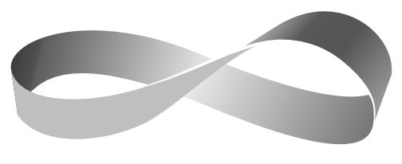

# Möbius (Moebius)

A system to process, enrich and correlate events in realtime.

## Usage

For Moebius usage please see [stream processing](/docs/development/stream-processing.md).

## License

Copyright © 2015-2016 Samsara's authors

Distributed under the Apache License v 2.0 (http://www.apache.org/licenses/LICENSE-2.0)
