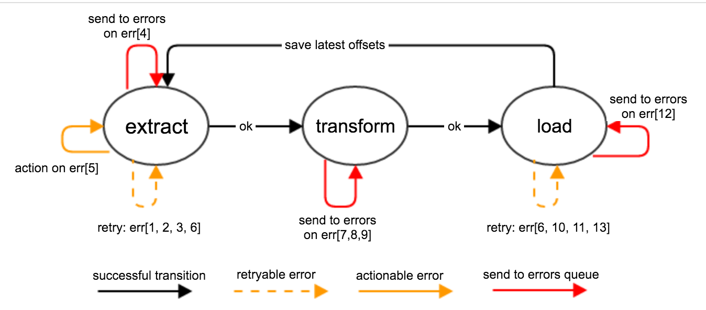
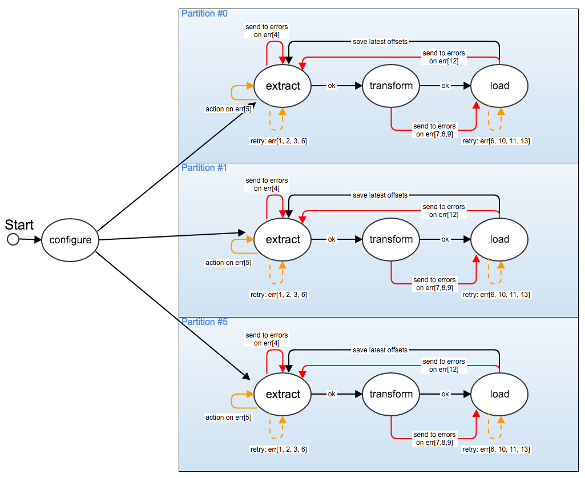

# Qanal state machine

Qanal design  goal is to  make a system  which is highly  resilient to
many different  type of failures.   For a successful  operation, qanal
needs  to  communicate   with  several  systems  such   as  Kafka  and
ElasticSearch.  Both  systems typically are  deployed in a  cluster of
machines.   In addition  to that  it is  common to  have ElasticSearch
RESTful interface behind a LoadBalancer.  In such setup many different
errors can arise. We tried to list  all major class of errors.  By any
means  this is  an exhaustive  list of  possible error,  but just  the
common ones.   We will also  see how  we can handle  unexpected errors
which are not listed here.

Common operational errors:

| Error Code | Description                   | Action                            |
|-----------:|-------------------------------|-----------------------------------|
|          0 | Uncategorized error           | Reset to initial state.           |
|          1 | Kafka unavailable             | Retry                             |
|          2 | Topic not found               | Retry                             |
|          3 | Partition not found           | Retry                             |
|          4 | Message too big               | Send to Error                     |
|          5 | Offset not available          | Action - Reset to earliest/latest |
|          6 | Network exceptions            | Retry                             |
|          7 | Invalid Message format        | Send to Error                     |
|          8 | Invalid Event                 | Send to Error                     |
|          9 | Transformation Error          | Send to Error                     |
|         10 | ELS not available             | Retry                             |
|         11 | ELS response status 5xx       | Retry                             |
|         12 | Bulk response contains errors | Send to Error                     |
|         13 | ELS response status 4xx       | Retry                             |

In order  to understand how  the system can  recover in face  of these
errors  we decided  to  build  the qanal  core  using  a Finite  State
Automata (or State Machine).  A  State Machine give us the possibility
to define how to handle a given error in relation to the current state
of the system. Another great property  of State Machine models is that
the _current_ state  is typically inspectable. In other  words you can
connect to a running system and see what is going on right now, and in
which state the System is. This  property comes very useful to extract
and publish processing metrics as you  only need to sample the current
state and push the information to a monitoring system.

Here is a diagram of qanal's state machine.

### state: `extract`

The first state attempt to extract the next few messages from the kafka.
The follow things can happen:

  - No messages are available, then retry later
  - `err[1]`: **Kafka unavailable**, then retry later
  - `err[2]`: **Topic to consume is not found**, then retry later
  - `err[3]`: **Partition to consume is not found**, then retry later
  - `err[6]`: **Generic network exception**, retry later
  - `err[4]`: **Message too big**, then send to `_errors` topic
  - `err[5]`: **Offset requested not available**. This can happen in two following cases:
    - _No previous checkpoint_: you are starting to consume a topic
        for the first time, and the is no previous offset. In this
        case consumer will reset the offset to the `:earliest` or
        `:latest` position depending on the configuration.
    - _The requested offset is too old_: this happens when the
        consumer fell too far behind and the Kafka server already
        deleted the older messages. The consumer will reset the offset
        to the earliest available offset.
    - _The requested offset is greater than the latest available
        one_: This is quite rare, but in this case the consumer will
        reset the consumer offset to the latest available point.
  - A number of messages (**batch**) have been found and fetched (as
    byte-arrays). In this case we move to the next state.

 * **TODO:** add empty result in chart
 * **TODO:** send to `_errors` can fail too, add retry (on all states)

### state: `transform`

In this case we try to make sense of the messages fetched from Kafka
and we turn them into events and prepare them in the right format for
ElasticSearch.  In this phase we validate the messages and we use
dispatch functions to determine the correct target index. We might
even include a custom transformation function. At this stage we have
received a batch of messages from the previous step, so we apply the
transformation to each message in the batch and one of the following
things can happen:

  - `err[7]`: **Invalid Message format**. The given message is not a
    JSON formatted string, maybe not even a valid string. Then we send
    to `_errors`.
  - `err[8]`: **Invalid event**. The given message is not a valid
    event. Then we send it to `_errors`
  - `err[9]`: **Transformation error**: An error occurred during the
    transformation. Then we send it to the `_errors` topic
  - The transformation is successful so we move to the next state.

Since the transformation is applied to every message in the batch at
the end you can end up with a number of events which have different
outcome. Some may fail, some may successfully being processed so the
output of this state is two set of messages: _the erorrs_ and _the
processed_. One of the two sets can even be empty in case all message
fail or all messages are successfully processed. The errors are sent
to the `_errors` topic and the processed will be moved to the next
state.

### state: `load`

In this state we try to bulk-load the processed events into
ElasticSearch. As for the other states one of the following things can
happen:

  - `err[6]`: **Generic network error**, then retry later
  - `err[10]`: **ELS unavailable**, then retry later
  - `err[11]`: **ELS returns HTTP status 5xx**, then retry later
  - `err[13]`: **ELS returns HTTP status 4xx**, then retry later
  - `err[12]`: **ELS bulk response contains errors**, then we send the
    failed items to `_errors`, we update the processed offsets and we
    move to the `extract` state.
  - The bulk load succeed then we update the processed offsets and we
    move to the `extract` state again.

## Multi topics/partitions handling

The above state machine is for a single thread consumer.  If we are
consuming more topics and more partitions then we can have a state
machine for every processing thread.

The `configure` step would read the given configuration and decide how
many consumer threads  are required for the processing and  spin up an
appropriate number of dedicated threads.
